Programming assignment 4
================

**Author**: Eva Maria Corregidor Luna **Date**: Last update: 2025-11-25
21:04:02.510674

# Overview

<!-- 
  Talk briefly about what you did here 
  Describe your hypotheses
-->

First, I ran the script that normalizes the peak intensity of all of the
files in the ‘wav’ folders. Then, I created the TextGrids with the
script \#1 and segmented each .wav file. This took about 3hrs. Lastly, I
used the script \#2 to extract the vals. This was confusing because I
added a \# acidentaly and so the script did not work. It was a silly
mistake that Robert helped me to find.

Now that I am familiar with the data, I can generate some hypotheses.

H1. EN monolinguals will produce longer VOT for /p t k/ than SP-EN
bilinguals.

Thinking: sounds are aspirated in EN but not in SP. Given
cross-linguistic issues, SP-EN bilinguals probably produced
non-aspirated sounds in some trials, resulting in shorter VOTs. EN
monolinguals probably produced always aspirated sounds, resulting in
longer VOTs.

H2. The vowel space of SP-EN bilinguals will be wider and broader than
the vowel space of EN monolinguals.

Thinking: most likely, bilinguals produced sounds from both languages,
and EN monolinguals only from EN, resulting in more variability for the
first group. More variability = wider vowel space.

H3. For \[e\], SP-EN bilinguals will produce higher F2 than
EN-monolinguals.

Thinking: when pronouncing /e/, SP requires speakers to place the tongue
at the front of the mouth, resulting in a high F2 value, while EN /ɛ/
requires speakers to place the tongue at a more central position,
resulting in a low F2 value.

# Prep

## Libraries

## Load data

``` r
# You need to get all the files in the 'data' directory and combine them
# Check previous examples we did in class 

data <- fs::dir_ls(here::here("data"), regexp = "csv$") |>
  map_dfr(read_csv)
```

    ## Rows: 45 Columns: 5
    ## ── Column specification ────────────────────────────────────────────────────────
    ## Delimiter: ","
    ## chr (2): fileID, notes
    ## dbl (3): f1, f2, vot
    ## 
    ## ℹ Use `spec()` to retrieve the full column specification for this data.
    ## ℹ Specify the column types or set `show_col_types = FALSE` to quiet this message.
    ## Rows: 45 Columns: 5
    ## ── Column specification ────────────────────────────────────────────────────────
    ## Delimiter: ","
    ## chr (1): fileID
    ## dbl (3): f1, f2, vot
    ## lgl (1): notes
    ## 
    ## ℹ Use `spec()` to retrieve the full column specification for this data.
    ## ℹ Specify the column types or set `show_col_types = FALSE` to quiet this message.
    ## Rows: 45 Columns: 5
    ## ── Column specification ────────────────────────────────────────────────────────
    ## Delimiter: ","
    ## chr (1): fileID
    ## dbl (3): f1, f2, vot
    ## lgl (1): notes
    ## 
    ## ℹ Use `spec()` to retrieve the full column specification for this data.
    ## ℹ Specify the column types or set `show_col_types = FALSE` to quiet this message.
    ## Rows: 45 Columns: 5
    ## ── Column specification ────────────────────────────────────────────────────────
    ## Delimiter: ","
    ## chr (1): fileID
    ## dbl (3): f1, f2, vot
    ## lgl (1): notes
    ## 
    ## ℹ Use `spec()` to retrieve the full column specification for this data.
    ## ℹ Specify the column types or set `show_col_types = FALSE` to quiet this message.
    ## Rows: 45 Columns: 5
    ## ── Column specification ────────────────────────────────────────────────────────
    ## Delimiter: ","
    ## chr (1): fileID
    ## dbl (3): f1, f2, vot
    ## lgl (1): notes
    ## 
    ## ℹ Use `spec()` to retrieve the full column specification for this data.
    ## ℹ Specify the column types or set `show_col_types = FALSE` to quiet this message.
    ## Rows: 45 Columns: 5
    ## ── Column specification ────────────────────────────────────────────────────────
    ## Delimiter: ","
    ## chr (1): fileID
    ## dbl (3): f1, f2, vot
    ## lgl (1): notes
    ## 
    ## ℹ Use `spec()` to retrieve the full column specification for this data.
    ## ℹ Specify the column types or set `show_col_types = FALSE` to quiet this message.

## Tidy data

``` r
# Convert from long to wide or wide to long format as necessary (check 
# examples from class)
# Create any other relevant variables here 

data_tidy <- data |>
  separate(fileID, into = c("participant", "item"), sep = "_")

# data frame I might need for H1

data_vot <- data_tidy |>
  select(participant, item, vot)

# data frame I might need for H2

data_f1_f2 <- data_tidy |>
  select(participant, item, f1, f2)

# data frame I might need for H3

data_e_f2 <- data_tidy |>
  select(participant, item, f2) |>
  pivot_wider(names_from = item, values_from = f2) |>
  select(participant, keke,keke1, keke2, teke, teke1, teke2, peke, peke1, peke2)
```

# Analysis

## Descriptives

``` r
# Give some descriptive summaries of your data 
# Display your descriptives in a table (try knitr::kable())

data_vot |>
  summarize(
    vot_avg = mean(vot),
    vot_sd = sd(vot)
  ) |>
  knitr::kable()
```

|  vot_avg |  vot_sd |
|---------:|--------:|
| 27.95485 | 17.3293 |

``` r
# summary of bilinguals

data_vot |>
  filter(participant == c("bi01", "bi02", "bi03")) |>
  summarize(
    vot_avg = mean(vot),
    vot_sd = sd(vot)
  ) |>
  knitr::kable()
```

|  vot_avg |   vot_sd |
|---------:|---------:|
| 19.55089 | 7.759775 |

``` r
# summary of monolinguals

data_vot |>
  filter(participant == c("ne01", "ne02", "ne03")) |>
  summarize(
    vot_avg = mean(vot),
    vot_sd = sd(vot)
  ) |>
  knitr::kable()
```

|  vot_avg |   vot_sd |
|---------:|---------:|
| 34.60333 | 18.14679 |

``` r
# summary of [k] (just to test if I know how to do it)

data_vot |> 
  filter(item == c("kaka", "kaka1", "kaka2", "keke", "keke1", "keke2", "kiki", "kiki1", "kiki2", "koko", "koko1", "koko2", "kuku", "kuku1", "kuku2")) |>
  summarize(
    vot_avg = mean(vot),
    vot_sd = sd(vot)) |>
  knitr::kable()
```

|  vot_avg |   vot_sd |
|---------:|---------:|
| 38.25689 | 20.31099 |

## Visualization

``` r
# Include some plots here

# Remembering H1: EN monolinguals will produce longer VOT for /p t k/ than SP-EN bilinguals.

# I want to plot the mean VOT for EN monolinguals compared to SP-EN bilinguals

# I plot it with geom_jitter

data_vot |>
  ggplot(
    aes(x = participant, y = vot)) +
  geom_jitter(height = 0, width = 0.2, alpha = 0.4) +
  stat_summary(
    fun.data = mean_sdl,
    geom = 'pointrange') +
  scale_color_viridis_d(guide = "none", begin = 0.2, end = 0.8) +
  labs(
    title = "VOT values for /p t k/",
    x = "Participants (bi = SP-EN bilinguals, ne = EN monolinguals)",
    y = "VOT (ms)")
```

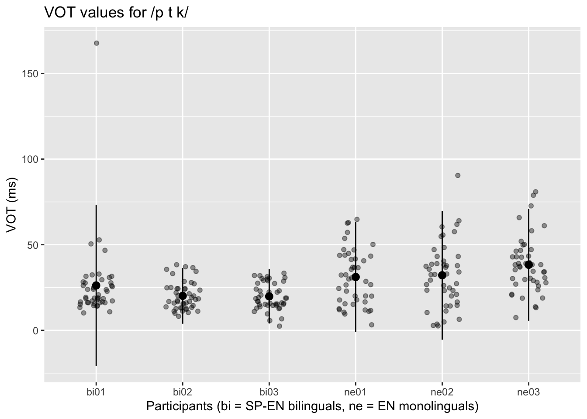

``` r
# but boxplot seems more clear

data_vot |>
  ggplot(
    aes(x = participant, y = vot, color = participant)) +
  geom_boxplot() +
  scale_color_viridis_d(guide = "none", begin = 0.2, end = 0.8) +
  labs(
    title = "VOT values for /p t k/",
    x = "Participants (bi = SP-EN bilinguals, ne = EN monolinguals)",
    y = "VOT (ms)")
```

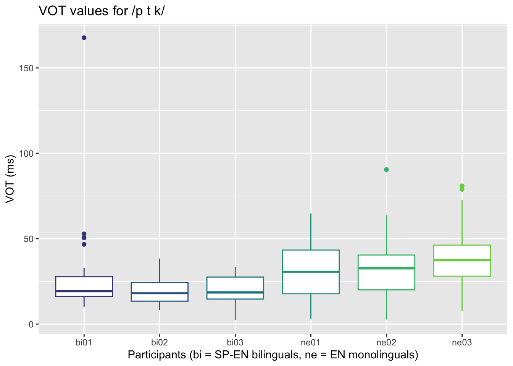

``` r
# Remembering H2: The vowel space of SP-EN bilinguals will be wider and broader than the vowel space of EN monolinguals.

# for bilinguals
data_f1_f2_bi <- data_f1_f2 |>
  filter(participant == c("bi01", "bi02", "bi03")) 

data_f1_f2_bi|>
  ggplot() +
  aes(x = f2, y = f1, color = participant, label = participant) + 
  geom_text(size = 3.5, alpha = 0.6, show.legend = F) + 
  geom_text(data = data_f1_f2_bi, show.legend = F, size = 7) + 
  scale_y_reverse() + 
  scale_x_reverse() + 
  scale_color_brewer(palette = "Set1") + 
  labs(
    title = "Vowel Space for SP-EN bilinguals", 
    y = "F1 (Hz)", 
    x = "F2 (Hz)"
  ) + 
  theme_minimal(base_size = 16)
```

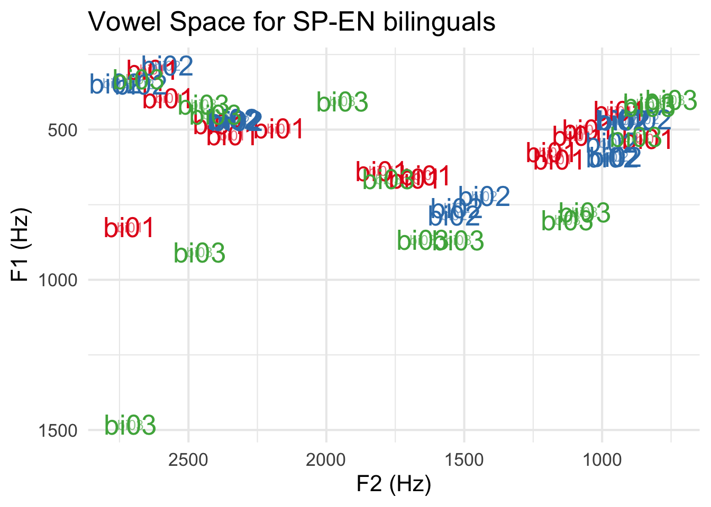

``` r
# for monolinguals 

data_f1_f2_mo <- data_f1_f2 |>
  filter(participant == c("ne01", "ne02", "ne03"))

data_f1_f2_mo|>
  ggplot() +
  aes(x = f2, y = f1, color = participant, label = participant) + 
  geom_text(size = 3.5, alpha = 0.6, show.legend = F) + 
  geom_text(data = data_f1_f2_mo, show.legend = F, size = 7) + 
  scale_y_reverse() + 
  scale_x_reverse() + 
  scale_color_brewer(palette = "Set1") + 
  labs(
    title = "Vowel Space for EN monolinguals", 
    y = "F1 (Hz)", 
    x = "F2 (Hz)"
  ) + 
  theme_minimal(base_size = 16)
```

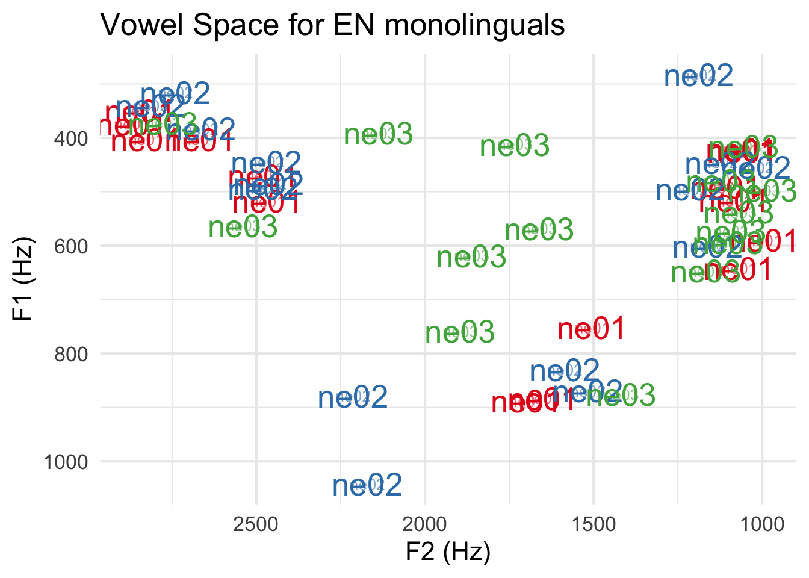

``` r
# Remembering H3: For [e], SP-EN bilinguals will produce higher F2 than EN-monolinguals.

data_e_f2 |>
  ggplot(
    aes(x = participant, y = keke)) +
  geom_point()
```


``` r
data_e_f2 |>
  ggplot(
    aes(x = participant, y = keke1)) +
  geom_point()
```

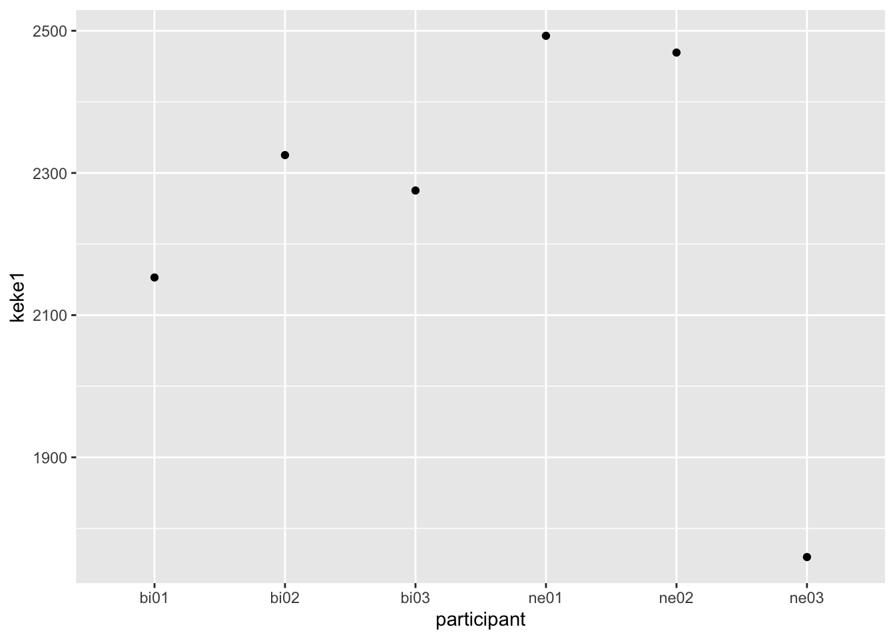

``` r
data_e_f2 |>
  ggplot(
    aes(x = participant, y = keke2)) +
  geom_point()
```

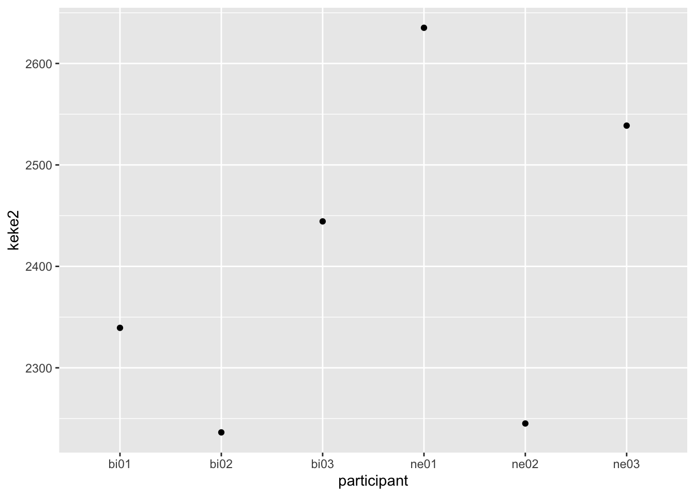

``` r
data_e_f2 |>
  ggplot(
    aes(x = participant, y = peke)) +
  geom_point()
```

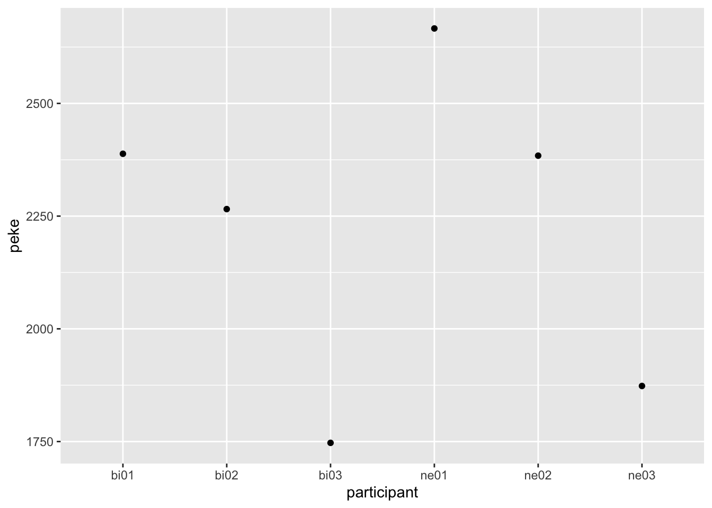

``` r
data_e_f2 |>
  ggplot(
    aes(x = participant, y = peke1)) +
  geom_point()
```


``` r
data_e_f2 |>
  ggplot(
    aes(x = participant, y = peke2)) +
  geom_point()
```


``` r
data_e_f2 |>
  ggplot(
    aes(x = participant, y = teke)) +
  geom_point()
```

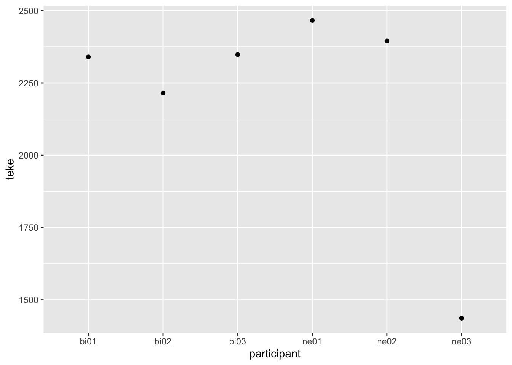

``` r
data_e_f2 |>
  ggplot(
    aes(x = participant, y = teke1)) +
  geom_point()
```


``` r
data_e_f2 |>
  ggplot(
    aes(x = participant, y = teke2)) +
  geom_point()
```

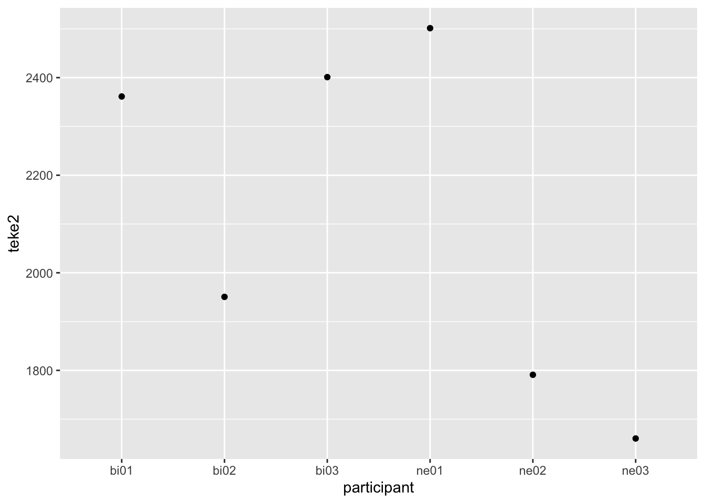

``` r
# Now, the acoustics of the production data. I include an spectogram and waveform example of the production of /e/ for a bilingual participant (bi01) and the /ɛ/ for a monolingual participant (ne01). More concretely, the first syllable of keke.

knitr::include_graphics(here("ke_bi01_spect.png"))
```

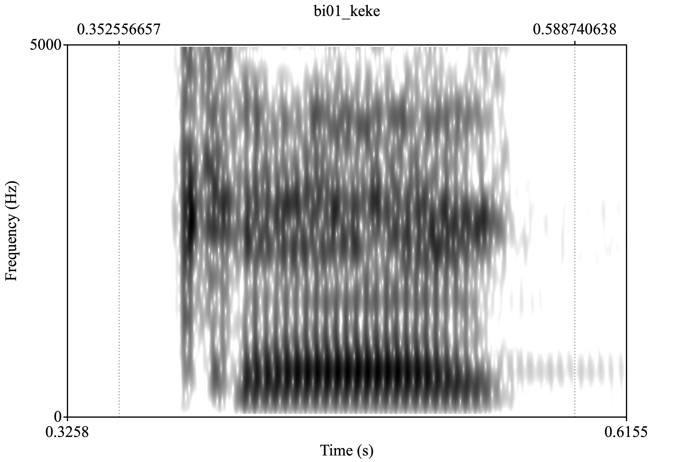<!-- -->

``` r
knitr::include_graphics(here("ke_bi01_wave.png"))
```

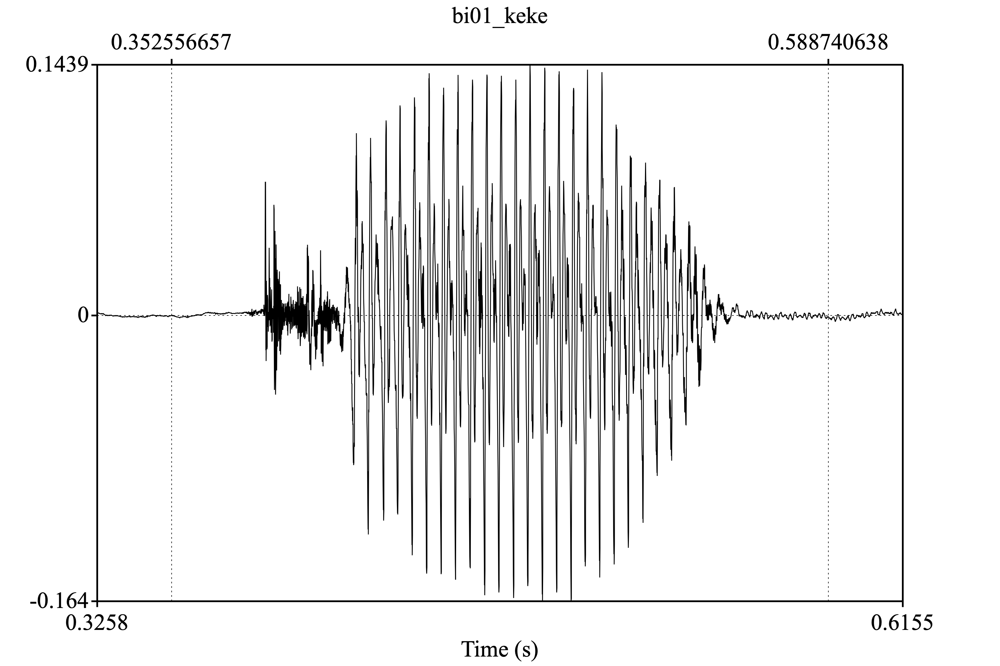<!-- -->

``` r
knitr::include_graphics(here("ke_ne01_spect.png"))
```

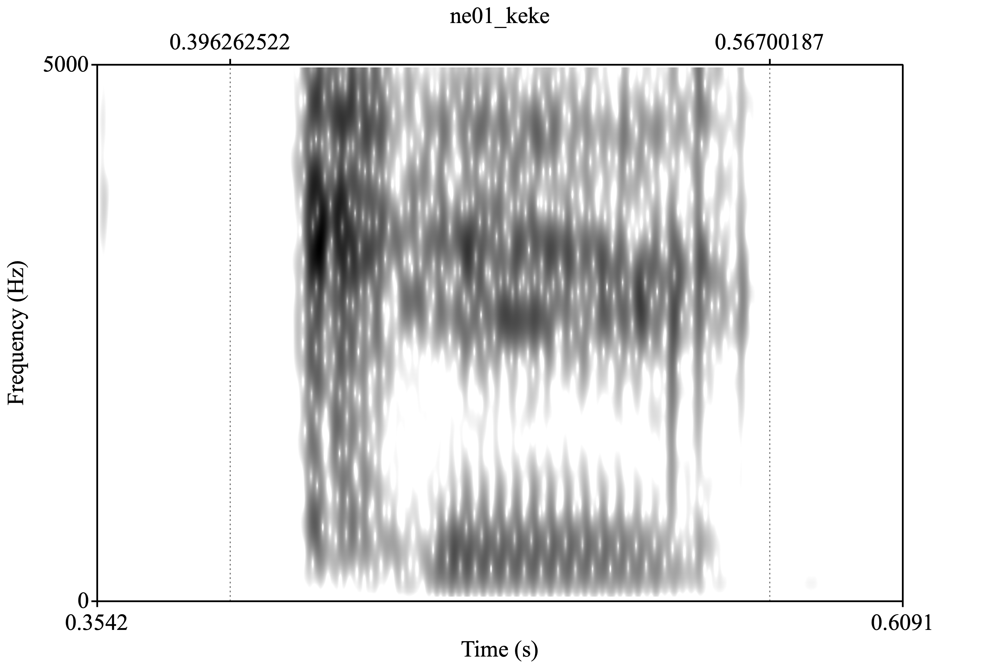<!-- -->

``` r
knitr::include_graphics(here("ke_ne01_wave.png"))
```

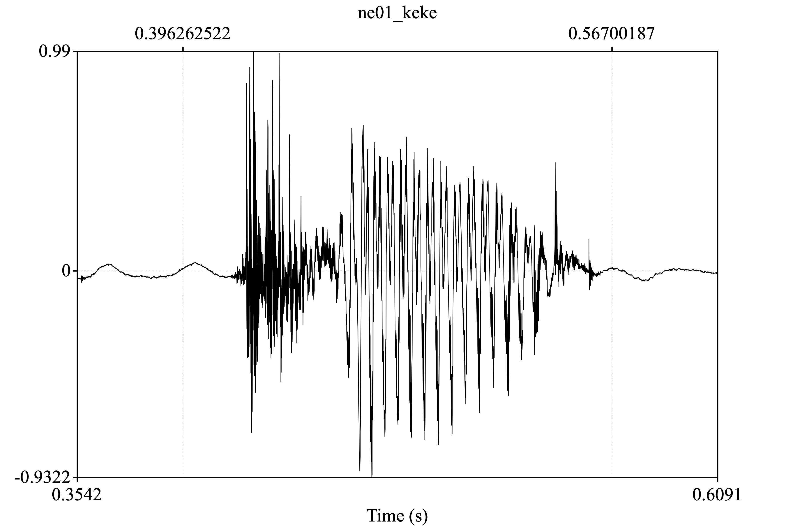<!-- -->

<!-- 
Also include a professional looking figure illustrating an example of the acoustics 
of the production data, i.e., a plot generated in praat.
You decide what is relevant (something related to your hypothesis). 
Think about where this file should be located in your project. 
What location makes most sense in terms of organization? 
How will you access the file (path) from this .Rmd file?
If you need help consider the following sources: 
  - Search 'Rmarkdown image' on google, stackoverflow, etc.
  - Search the 'knitr' package help files in RStudio
  - Search the internet for HTML code (not recommended, but it works)
  - Check the code from my class presentations (may or may not be helpful)
-->

## Hypothesis test

``` r
# Conduct a simple statistical analysis here (optional)
```

For H1 (EN monolinguals will produce longer VOT for /p t k/ than SP-EN
bilinguals) we can use the avg. summary obtained through the descriptive
analysis.

vot avg. (bi) = 19.55

vot avg. (mo) = 34.6

The hypothesis can also be reviewed looking at the plot: the mean of all
monolingual participants, to the right, is always higher than that of
bilingual participants, to the left.

For H2 (the vowel space of SP-EN bilinguals will be wider and broader
than the vowel space of EN monolinguals), we can scrutinize the plots.
The vowel space plot of monolinguals seems to be more spread out than
that of bilinguals. Data visualization might not have been done properly
(that is, I didn’t plot the vowel spaces correctly).

For H3 (in \[e\], SP-EN bilinguals will produce higher F2 than
EN-monolinguals), we can scrutinize each plot of all the items
containing \[e\]. Monolinguals seem to produce higher values in all
trials. Participant ne03 has extremely low values. Participant ne01
produced always high values.

# Conclusion

<!-- 
Revisit your hypotheses (refer to plots, figures, tables, statistical tests, 
etc.)
&#10;Reflect on the entire process. 
What did you enjoy? What did you hate? What did you learn? 
What would you do differently?
-->

Completing PA 4 was at times fun, at times difficult. In terms of the
hypotheses, H1 was the easiest to test and it looks like it is
confirmed. H2 and H3 seem to be wrong based on how I plotted everything,
although I think (a) the plots were not completed properly and (b)
segmentation might not be ok, resulting in inaccurate results. \[I kind
of revisited the hypotheses already above as well\]

Halfway the visualization part, R session was aborted again and changes
were not saved, so I had to do it all again. That was frustrating, but I
got on track again quickly. I also think I did too many unnecessary
steps which show that I need to better understand R language to
automatize more each task (*what I learned and I would do differently*)

Overall, I think it was worthy. Although segmentation was monotonous
(*what I hated*), I would recommend it to future students. I always
enjoy playing with the data frames, plots, and really anything with R
(*what I enjoyed*).

</br></br>
